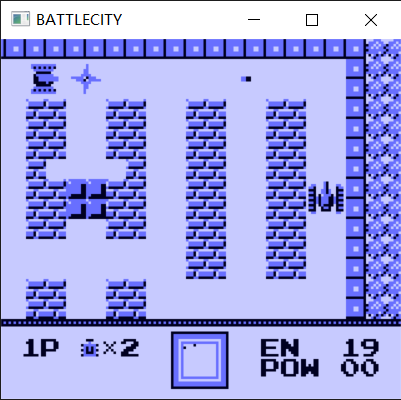
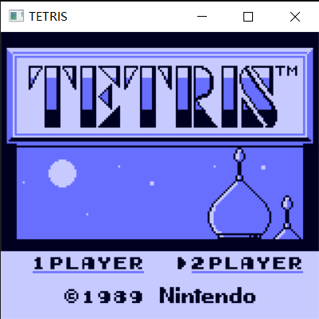
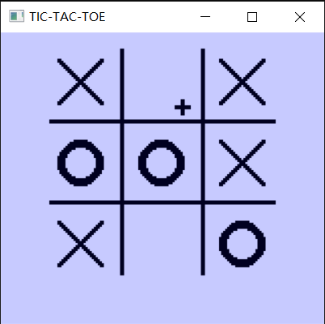
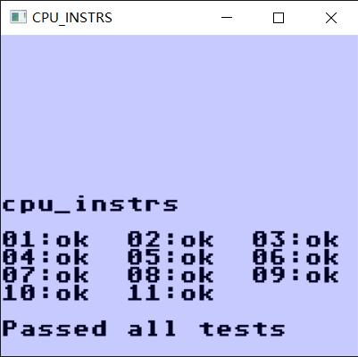

# TinyGameBoy

A very naive GameBoy Emulator written in C, developed by Visual Studio on Windows 10. 

## Features

- Accurately simulate each cpu instruction

- Support for MBC1, MBC2, MBC3 and MBC5

- Multimedia using light-weight, cross-platform [Simple DirectMedia Layer (SDL)](https://www.libsdl.org) library

- Window resizing

- Disable/enable each audio channel individually

## Screenshots







## Building (Windows)

Just open the Visual Studio solution file `GameBoy.sln`, and use Visual Studio to build and run it. 

The libSDL environment is already configured.

## Building (Linux)

**I only tested it on ubuntu.**

First, install the `libsdl2-dev` package.

```bash
$ sudo apt install libsdl2-dev
```

Then, do `make` to build the program

```bash
$ make
```

Last, run the emulator

```bash
$ ./gameboy
```

## Running
| Action                    | Key               |
|---------------------------|-------------------|
| DPAD-UP                   | <kbd>↑</kbd>      |
| DPAD-DOWN                 | <kbd>↓</kbd>      |
| DPAD-LEFT                 | <kbd>←</kbd>      |
| DPAD-RIGHT                | <kbd>→</kbd>      |
| B                         | <kbd>Z</kbd>      |
| A                         | <kbd>X</kbd>      |
| START                     | <kbd>Enter</kbd>  |
| SELECT                    | <kbd>Return</kbd> |
| Disable audio channel 1-4 | <kbd>F1-F4</kbd>  |

## TEST

Now this simulator can pass the test rom on cpu instructions.



## BUGS & TODOS

- Memory banking sometimes not working correctly.

- Fix bugs in the audio system, now it sounds strange.

    - It seems that using unsigned integer to represent audio signal is a complete fault.

- Interruption timing needs to be improved.
